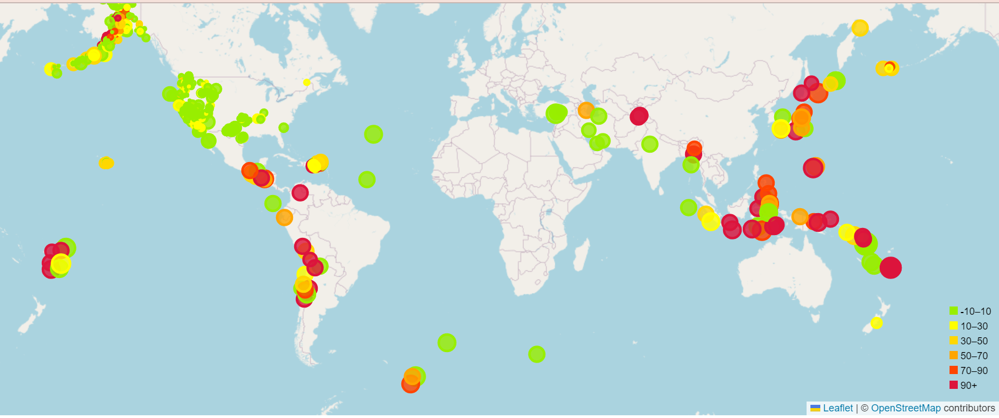
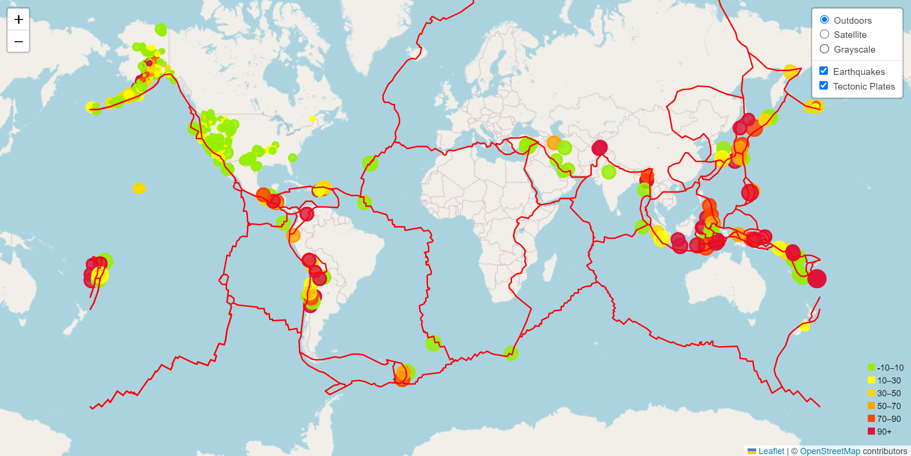

Module 15 Challenge

<ins>Project Overview</ins>
-----

This project developed a way to visualize the United States Geological Survey, or USGS, data to allow them to better educate the public and other government organizations on issues facing our planet. The two parts of this project worked towards building a new set of tools to visualize earthquake data as compared to the location of tectonic plates across the world. Being able to show both of these data points overlayed on each other is a powerful visualization in service of the USGS' project needs.

<ins>Processes and Technologies</ins>
-----

This project uses both **HTML** and **JavaScript** in order to create the visualizations below. Given the styles.css and index.html files, I was able to create a logic file that reads in the JSON data and logs it into the console. I created a title layer that contains the street map and then ran a function to fetch the earthquake data and add it to the map in the form of markers that reflect the magnitude of the earthquake by their size and the depth of the earthquake by color. Popups were also added to provide additional information about the earthquake when you hover over the marker. Lastly, I was able to add in a scaled legend that reflects the same marker information.

For the second part of the challenge, I was able to use basically the same code as the first part. The only addition I made was to add in more than one layer of map and that ability to toggle between them. Layers include topographical map, street map and tectonic plate lines.

<ins>Challenges</ins>
-----

The biggest challenge I ran into with this challenge was being able to create the scaled legend and have it show up on the screen with the correct colors and labels. When I first created the legend, I tried to initialize it before the "map" variable was created and then the legend did not show up. After I changed the order of the code and included the `legend.addTo(map);` within the correct function, everything showed the way it was meant to.
